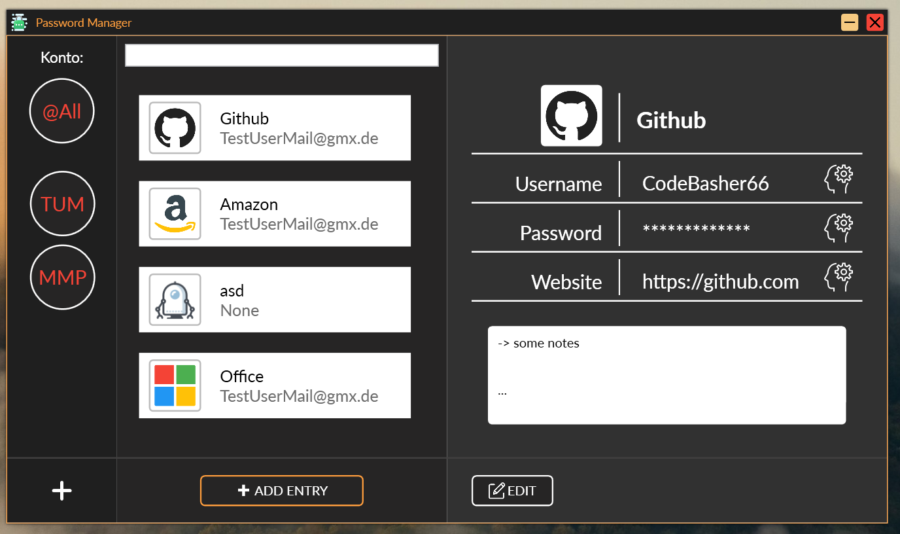
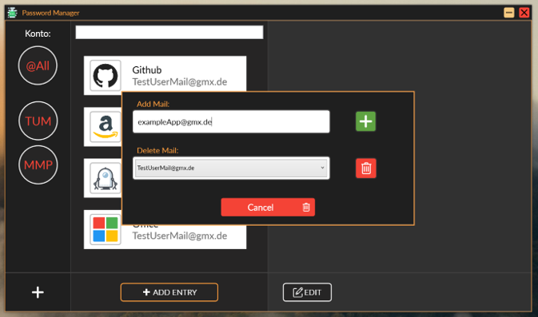
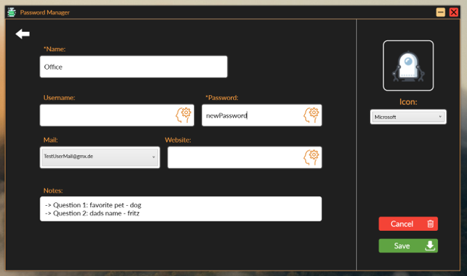
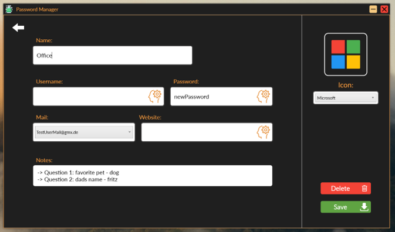

---

## General
This is a simple, quick and easy to use **"Password Manager"** I have coded during corona crises. All common features are included. For example adding new mail addreses or new accounts. You can edit the accounts every time you want just by clicking the edit button. If you want to use a information just click on the brain button on the right to each element. It then will be copied to your clipboard and you can easily paste it on your chosen Login form. All your data is stored locally and will be backuped in a folder every time you close the app.

| Overview     | Mail     |
| :------------- | :------------- |
|        |      |

| Create     | Edit     |
| :------------- | :------------- |
|        |      |

---

## Installation 

1. Download or clone the repository. 
2. In case you downloaded the file you need to unpack it by using something like [WinRAR](https://www.chip.de/downloads/WinRAR-64-Bit_37666786.html).
3. Grap the unpacked folder and move it to your favorite location **[⚠*be aware of permissions*⚠]**.
4. Now enter **..\1.0.Beta PasswordManager\bin\Debug** and run the **”Password Manager.exe”** file.
5. Additionally you can send the **".exe"** file to your desktop or a other location to have easy access. 

---

## Updating
1. Follow the installation guide till you reach step 3.
2. Now go to **..\1.0.X PasswordManager\bin\Debug** in your currently unpacked folder and delete the **"database.exe"** file
3. Last but not least drag and drop all files from the newer version into your old version so all changed files will be replaced
---
## Shortcuts
  
**Overview-Page:**

| Key     | Function     |
| :------------- | :------------- |
| STRG + r  | reloads the page |
| STRG + n | goto: add new account window |
| STRG + e | goto: edit selected account window|
| STRG + m | goto: add new mail window |
| STRG + f | toggle search |
| STRG + s | toggle search |

&nbsp;

**Create-Page:**

| Key     | Function     |
| :------------- | :------------- |
| STRG + b  | reloads the page |
| STRG + ENTER | add new account |

&nbsp;

**Edit-Page:**

| Key     | Function     |
| :------------- | :------------- |
| STRG + b  | goto: overview window|
| STRG + ENTER | apply changes to current account |
| STRG + d  | delete current account |
| STRG + t | focus: name input |
| STRG + u  | focus: username input |
| STRG + p | focus: password input |
| STRG + w  | focus: website input |
| STRG + n | focus: notes input |

---
## Bugs
